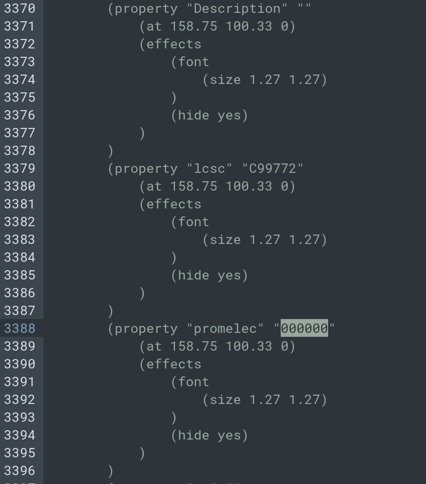

# Технические требования для schPropEdit

**Цель**: Разработать микропрограмму осуществляющую изменения полей в kicad схеме.

### Режим одиночной замены (аргументы):

```bash
python schPropEdit.py "ФАЙЛ" \
    -s "ИСКОМЫЙ ПАРАМЕТР" \
    -sv "ЗНАЧЕНИЕ ИСКОМОГО ПАРАМЕТРА" \
    -c "ПАРАМЕТР ТРЕБУЮЩИЙ ИЗМЕНЕНИЯ" \
    -cv "ЗНАЧЕНИЕ, КОТОРОЕ СЛЕДУЕТ УСТАНОВИТЬ"
```

Примеры команд:

```bash
python schPropEdit.py file.kicad_sch \
    -s "lcsc" \
    -sv "C99772" \
    -c "chipdip" \
    -cv "000000"
```



Если "ПАРАМЕТР ТРЕБУЮЩИЙ ИЗМЕНЕНИЯ" не существует создать его аналогичным "ИСКОМЫЙ ПАРАМЕТР" в соответствии с структурой файла.

### Режим пакетной замены (`--csv`)

Флаг `--csv` принимает путь к CSV-таблице замен из 4х столбцов: `search_name,search_value,change_name,change_value`. Каждая строка таблицы описывает одну замену, эквивалентную одиночному режиму (`-s,-sv,-c,-cv`).

Флаг `--csv` не может быть объединён с `-s/-sv/-c/-cv` — используется либо один, либо другой режим.

Пример таблицы замен:

```csv
search_name,search_value,change_name,change_value
lcsc,C99772,mpn,STM32F103C8T6
lcsc,C82942,mpn,LM358DR
```

Пример команды:

```bash
python schPropEdit.py file.kicad_sch --csv replacements.csv
```

Файл `"ФАЙЛ"` должен читаться и парситься ровно один раз независимо от количества строк в таблице замен: все замены применяются к разобранной структуре в памяти, после чего результат записывается один раз. Это необходимо для производительности при большом количестве замен в одном файле.

Строки с пустыми значениями в любом из 4х столбцов пропускаются с предупреждением в `stdout`, выполнение программы не прерывается.

### Требование к реализации:

- Язык программирования `python3`

- Отсутствие внешних зависимостей для `python`, разрешено использовать только встроенные модули (возможно отклонение по согласованию) (доступен `pyparsing`)

- Программа должна запускаться и выполнять свою функцию в среде контейнера `ghcr.io/kicad/kicad:10.0`

- Программа должна иметь интерфейс управления посредством флагов командной строки

- Программа должна принимать/выдавать файл соответствующий примеру (см. приложение)

- В ходе работы в `stdout` должна отправляться информацию об выполненных/проваленных операциях. 

- Все не допустимые комбинации аргументов или неверные значения должны выдавать ошибку и завершать работу программы

- Файлы входные/выходные в кодировке `unix`/`utf8`

- Вся программа должна состоять из одного файла
